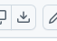

---
This code editor, "clooj-for-students", is a fork of [clooj](https://github.com/clj-commons/clooj) that only depends on one Java library named  `RSyntaxTextArea`.
---

### Try out clooj-for-students

The idea is to start two Java processes, first [Noj](https://github.com/scicloj/noj/releases) with Clay and then the clooj-for-students editor.

1) On the command line, type (if that does not work see section "Troubleshooting")

```
java -cp noj-2-beta19.1-uber.jar:./. clojure.main -e "(do (require '[scicloj.clay.v2.api :as clay]) (clay/make! {:live-reload true :base-source-path \"notebooks\" :base-target-path \"temp\"}))"
```

2) Download the file `clooj_student.clj` by pressing the "Download raw file" button on the right hand side of [this page](https://github.com/kloimhardt/clooj/blob/master/clooj_student.clj)

3) Download the file 'rsyntaxtextarea-3.6.1.jar' from [maven-central](https://repo1.maven.org/maven2/com/fifesoft/rsyntaxtextarea/3.6.1/)

4) On the command line, in the directory of the downloaded file, type:

```
java -cp noj-2-beta19.1-uber.jar:rsyntaxtextarea-3.6.1.jar clojure.main -e "(do (load-file \"clooj_student.clj\") (fegloj.main/-main))"
```
### Proposed roadmap for a SciCloj beginner experience

- Create the next release of [`noj-*-uber.jar`](https://github.com/scicloj/noj/releases) in such a way that on double-click (i.e. on open) the command of step 1) is executed. Especially add `./.` to the classpath (this enables notebooks to require other namespaces).
- Make `noj-*-uber.jar` show, on double-click (i.e. on open), a message that describes how to quit the process. This is because it seems that currently the `noj-*-uber.jar` can be started only once via double-click, it seems impossible to be stopped and restarted. At least, when I accidentally closed the Clay browser tab, I could not get it to reappear again with a new double-click on `noj-*-uber.jar`.
- Remove the Clay+Noj dependencies from [Fegloj](https://github.com/scicloj/fegloj). Rename the `fegloj.jar` release to `noj-wheels-*-uber.jar`. A double-click (i.e. open) on that .jar already executes step 4).

### Rationale

In order to provide a Clojure setup for students, Prof. Lee Spector reached out in [clojurian slack](https://clojurians.slack.com/archives/C0BQDEJ8M/p1768618664898069)

Quotes:

> Just watched the live-reload [noj in a jar videos]( https://www.youtube.com/watch?v=tDz1x2d65C0) and that project is a thing of beauty! For that to be our primary platform, however, we'd have to pair it with the right editor (where right for me means
> - trivial installation/setup,
> - includes bracket matching and
> - auto-reindenting, and
> - doesn't force parinfer or paredit or otherwise get in the way of normal text editing
>
> a student who is just working on code in a single Clojure file (yes, you can write interesting evolutionary algorithms in a single short file!), can add a bit of code to get a basic plot.

clooj-for-students fulfills these requirements for writing "a bit of code in a short file". Importantly, its only dependency is the actively developed Java library [com.fifesoft/rsyntaxtextarea](https://github.com/bobbylight/RSyntaxTextArea/releases)

### Why remove Clay from fegloj?

There is the opinion that [`noj-*-uber.jar`](https://github.com/scicloj/noj/releases) should not have any GUI functionality whatsoever. The opinion is that whoever wants a beginner experience with Clooj should produce an entirely independent `.jar` having a GUI and also containing Clay+Noj.

[Fegloj](https://github.com/scicloj/fegloj) is such an independent `.jar` having a GUI and containing Clay+Noj.

I think this all-in approach of the current fegloj repository is the wrong approach. There should be only one single place where one or more .jar files containing Clay+Noj is/are released. This is because a beginner in Clojure can well be a senior scientist. As such he deserves the hottest and latest release of noj from the official maintainers. He has no time for dealing with unofficial second hand stuff.

For SciCloj to provide a beginner experience, the official [`noj-*-uber.jar`](https://github.com/scicloj/noj/releases) must be able to display a minimal message to the user as he double clicks on it. Is that possible without a GUI-window opening, saying "hello, here is the "Quit" button"? Maybe there is a solution without a GUI-window, I do not know.

The beginner experience is: download `noj-*-uber.jar`and `noj-wheels-*-uber.jar` and double-click on both.

### Troubleshooting

In the above, I was assuming you already made first steps with Noj. If the hints below do not help, you need to be [getting Started with Noj](https://github.com/scicloj/noj?tab=readme-ov-file#getting-started-with-noj).

a) To check if Java is installed, type `java` on your command shell (you may decide to [install Java](https://adoptium.net/en-GB))

b) Do you have your own `noj-*-uber.jar`? If so, in the command line of step 2), change the version `2-beta19.1` to your version. Or download the `.jar` file  from the  [github-repo](https://github.com/scicloj/noj/releases) and copy it into the same directory as `clooj_student.clj`.

c) Try step 1) again

### Known Issues

This is a bare-bones version of [clooj](https://github.com/clj-commons/clooj). I will never add additional features. The aim of this clooj-for-students is that the user eventually switches to VSCode with [Calva](https://calva.io).

When the Java process is stopped in the console via Ctrl+Z, the editor remains open as an application that does not respond anymore. [Fegloj](https://github.com/scicloj/fegloj) does not have this problem.

### The File-Eval-Gui-Loop

Clojurians work with the Read-Eval-Print-Loop (REPL). Being a stepping stone for VSCode/Calva, clooj-for-students does not and will never support a REPL. The user of clooj-for-students is meant to work in [Noj.jar live-reload mode](https://github.com/scicloj/noj?tab=readme-ov-file#live-reload-with-clay).

The concept of File-Eval-Gui-Loop (FEGuiL a.k.a figwheel), although being a ClojureScript tradition, is not met with universal acclaim, I wrote a [long blog post](https://kloimhardt.github.io/blog/software/2025/03/12/scicloj_cli.html).

### Hack your own editor

Try changing the file `clooj_student.clj` in Clooj, and restart the editor.

Maybe search for the text "Welcome to clooj" and change it to "Welcome to awesome clooj".

See that change in your editor now? How cool is that?

### How to build clooj_student.clj

This step is for contributors to the clooj-for-students project only:
```
java -cp noj-2-beta19.1-uber.jar clojure.main -e "(load-file \"build_clooj_student.clj\")"
```
